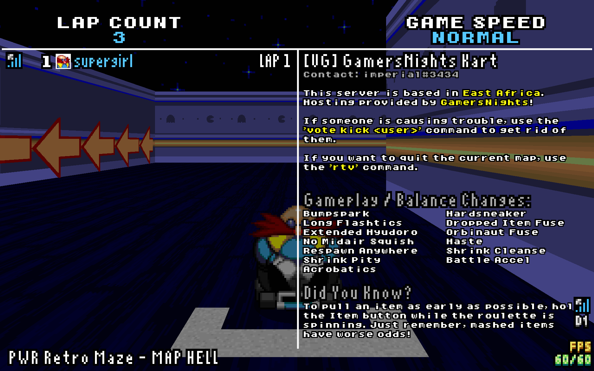

# GamersNights Kart (SRB2Kart)

[](https://x.com/gamersnights)

> A SRB2Kart experience in East Africa.



## Usage

To start the SRB2Kart dedicated netgame server on port `5029/udp`, run:

```shell
# Clone the repository
git clone https://github.com/rwanyoike/gamersnights-srb2kart
# Navigate to the project directory
cd gamersnights-srb2kart
# Set the necessary permissions
chmod -v 0777 ./data
# Start the container
docker compose up
```

## Addons

This server uses several addons not included in the repository. These addons must be downloaded separately. The expected checksums for these addons are listed in [SHA256SUMS](SHA256SUMS):

- KL_HOSTMOD_V18.pk3 ([discussion](https://mb.srb2.org/showthread.php?t=45107))
- KL_kartmp-v1.5.pk3 ([discussion](https://mb.srb2.org/showthread.php?t=47203))
- kl_DynMusic-v3.wad ([discussion](https://mb.srb2.org/showthread.php?t=45382))
- KL_MiniRankingPlus-v3.1.pk3 ([discussion](https://mb.srb2.org/showthread.php?t=47312))
- kl_hitfeed-v2.2.pk3 ([discussion](https://mb.srb2.org/showthread.php?t=45269))
- KL_HORNMOD-CE_V2.pk3 ([discussion](https://mb.srb2.org/showthread.php?t=44634))
- KL_Acrobatics-v0.5a.pk3 ([discussion](https://mb.srb2.org/showthread.php?t=47566))
- kl_driftgauge_v2.wad ([discussion](https://mb.srb2.org/showthread.php?t=45235))
- KL_KartExhaust_v4.pk3 ([discussion](https://mb.srb2.org/showthread.php?t=48207))
- KRB_IP-v2.1.pk3 ([discussion](https://mb.srb2.org/showthread.php?t=44856))
- KR_milkpack-v1.1.pk3 ([discussion](https://mb.srb2.org/showthread.php?t=46697))
- krl_NightmarePack_v4.pk3 ([discussion](https://mb.srb2.org/showthread.php?t=44285))
- KRL_SparkCup_V3.pk3 ([discussion](https://mb.srb2.org/showthread.php?t=45405))
- KL_Frenchorns_v1.3.pk3 (???)
- bonuschars.kart ([discussion](https://mb.srb2.org/showthread.php?t=43708))
